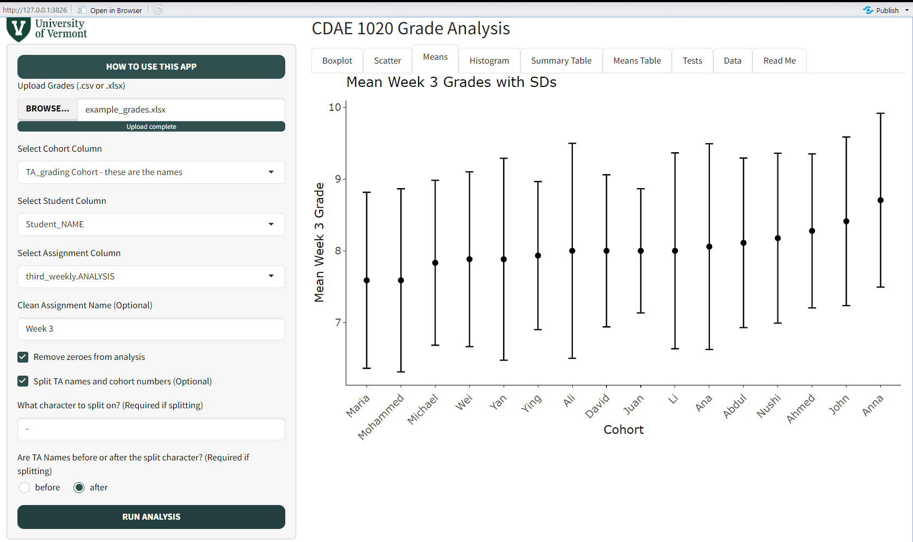

```{r, include = FALSE}
knitr::opts_chunk$set(
  collapse = TRUE,
  comment = "#>"
)
```

# Introduction

This is a Shiny app designed to help analyze grades across cohorts in the course CDAE 1020: World Food, Population, and Development. It allows you to upload a .csv or .xlsx file, select the relevant columns, and creates a series of interactive visualizations and tests organized by cohort. It also has a couple features for cleaning up assignment names, removing zeroes from the analysis, and splitting cohort names (assuming TA names are separated from cohort numbers by a consistent character).



# Using the App

This app will not be deployed to a server so as to avoid hurling sensitive information around the internet. To launch the app locally, first make sure RShiny is installed. Then, simply use `shiny::runGitHub()` from the R console with the repo information to run:

```{r run_app, eval = FALSE}
# install.packages('shiny')
shiny::runGitHub('ChrisDonovan307/grade_analysis_app')
```

Inside the app, use the green "How to use this app" button in the top left for more specific instructions. There is also a file of simulated data to test it out on in the `app_files` directory. That's it!
